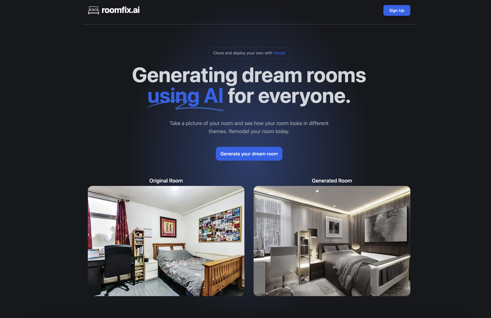

# [roomfix.ai](https://roomfix.ai)

This project generates new designs of your room with AI

[](https://roomfix.ai)

## How it works

It uses an ML model called [ControlNet](https://github.com/lllyasviel/ControlNet) to generate variations of rooms. This application gives you the ability to upload a photo of any room, which will send it through this ML Model using a Next.js API route, and return your generated room. The ML Model is hosted on [Replicate](https://replicate.com) and [Upload](https://upload.io) is used for image storage.

## Running Locally

### Cloning the repository the local machine.

```bash
git clone https://github.com/meteron-ai/roomfix
```

### Creating an account on Replicate to get an API key.

1. Go to [Replicate](https://replicate.com/) to create an account.
2. Click on your profile picture in the top right corner, and click on "Dashboard".
3. Click on "Account" in the navbar. And, here you can find your API token, copy it.

### Creating an account on Meteron which will provide queuing, storage and APIs to retrieve the images

1. Go to [Meteron](https://app.meteron.ai/) to create an account.
2. Click on "Add Cluster" button and select "Replicate", give it a name `replicate` then set the token from the previous section.
3. Get your Meteron API key from [API keys](https://app.meteron.ai/?tab=API%20Keys) tab.
4. Set this key as an environment variable.

### Storing the API keys in .env

Create a file in root directory of project with env. And store your API key in it, as shown in the .example.env file.

If you'd also like to do rate limiting, create an account on UpStash, create a Redis database, and populate the two environment variables in `.env` as well. If you don't want to do rate limiting, you don't need to make any changes.

### Installing the dependencies.

```bash
npm install
```

### Running the application.

Then, run the application in the command line and it will be available at `http://localhost:3000`.

```bash
npm run dev
```

## Auth setup

1. Use `openssl rand -base64 32` to generate NEXTAUTH_SECRET
2. Add DB URL and SHADOW DB URL from Neon
3. Create a new project in console.cloud.google.com
4. Click configure consent screen in API credentials page and click external
5. Add an app name, do not upload logo, add authorized domain
6. Publish app
7. Create credentials -> Oauth client ID (web application). The "Authorized redirect URIs" used when creating the credentials must include your full domain and end in the callback path. For example:
  - For production: https://{YOUR_DOMAIN}/api/auth/callback/google
  - For development: http://localhost:3000/api/auth/callback/google

8. Run npx prisma db push && prisma migrate dev && prisma generate

## One-Click Deploy

Deploy the example using [Vercel](https://vercel.com?utm_source=github&utm_medium=readme&utm_campaign=vercel-examples):

[](https://vercel.com/new/clone?repository-url=https%3A%2F%2Fgithub.com%2Fmeteron-ai%2Froomfix&env=METERON_API_KEY,NEXTAUTH_SECRET,GOOGLE_CLIENT_ID,GOOGLE_CLIENT_SECRET&envDescription=You%20will%20need%20to%20get%20Meteron%20(https%3A%2F%2Fmeteron.ai%2F)%2C%20Replicate%20(https%3A%2F%2Freplicate.com%2F)%20and%20Google%20auth%20client%20keys&envLink=https%3A%2F%2Fmeteron.ai%2F&demo-title=RoomFix&demo-url=https%3A%2F%2Froomfix.ai)

